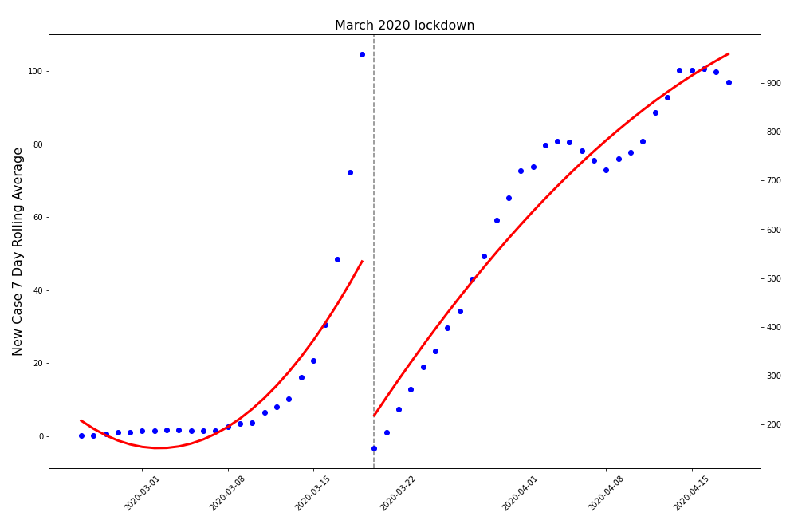
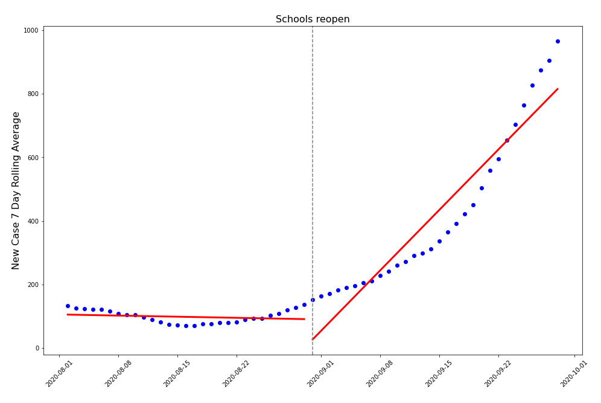
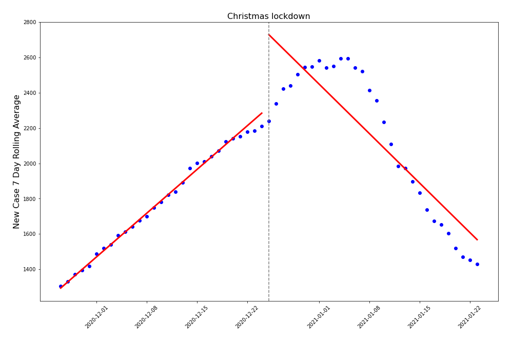

# Regression Discontinuity Design - COVID19 Analysis
See the full code [here](project/project_rdd.ipynb)  
Presentation date: July 5, 2022  
Collaborators: [Hasan Alqaroni](https://github.com/Halqaroni), [Devon Marcus](https://github.com/DevonMarcus), [Brian Wandum](https://github.com/wandum85)

The objective of this group project was to use regression discontinuity design to visualize the effects of three measures taken to mitigate the spread of COVID19 in the province of Quebec. These events were:
- The March 2020 lockdown
- The reopening of schools at the end of August 2020
- The Christmas 2020 lockdown 

### Design

We first found a dataset that contained information relating to COVID19 cases in Quebec. We narrowed our analysis down to either an analysis of daily deaths or daily new cases - we used visualizations to determine which trends were more consistent and better establish a basis of comparison. We also used a one-week rolling average of daily cases to better view the trend. Then we built regression models around each of the three events and compared before and after the date of interest, visualizing the regression line against the rolling average.

### Conclusions

For each event, there appears to be a significant effect of the actions taken on the progression of COVID19 cases. 

#### March 2020

The rate of case growth slowed from its initial exponential growth to a much more gradual growth ("flattening the curve"). 

#### August 2020

The regression lines show a very clear upward trend in case counts after schools reopened in August 2020.

#### December 2020

The regression lines show an upward trend prior to the lockdown, and a downward trend after. 
